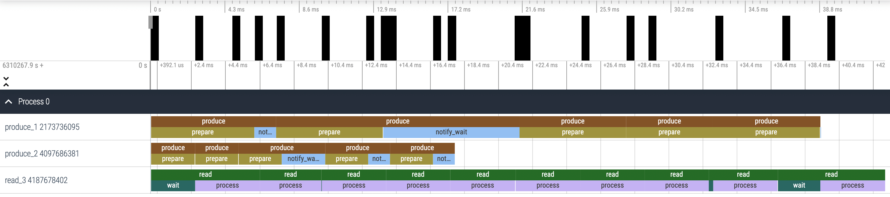

# Benchmark

Данной библиотекой мы пользуемся внутри компании для замеров пайпланов наших алгоритмов, ищем наиболее времязатратные места. Без нее никак не обойтись, если нам нужно понять как алгоритм работает на железе заказчика.
### Пример
```cpp
for (int i = 0; i < 100; i++) {
  R_BENCHMARK_START("algo");
  sleep_ms(i);
  R_BENCHMARK_STOP("algo");
}
std::cout << roadar::benchmarkLog() << std::endl;

// ================== Benchmark ==================
// algo:      total: 5288.20    times: 100    avg: 52.88    last avg: 97.92    percent: 100.0 %    missed: 0.0 %
// ===============================================
```

| Поле     | Значение | Описание                                                                                       |
|----------|----------|------------------------------------------------------------------------------------------------|
| total    | 5288.20  | суммарно сколько по времени исполнялся участок кода                                            |
| times    | 100      | сколько раз мы вызвали наш код                                                                 |
| avg      | 52.88    | сколько в среднем занял 1 вызов                                                                |
| last avg | 97.92    | сколько в среднем заняли последние 10 вызовов                                                  |
| percent  | 100.0 %  | сколько в процентах затрачено времени относительно других замеров (у нас 1 замер, поэтому 100%)|
| missed   | 0.0 %    | сколько процентов вложенных алгоритмов не было замерено (> 0 только где есть вложенные замеры) |

Тут из интересного `last avg` имеет намного более большое значение чем `avg`. С помощью этого параметра можно обнаружить что функция со временем начинает занимать значительно больше ресурсов. Этому подвержены алгоритмы, которые накапливают данные внутри.
### Вложенные замеры
Мы также можем внутри одного замера, запускать второй замер. Таким образом можно замерить как работают разные участки.
```cpp
R_BENCHMARK_START("algo");
for (int i = 0; i < 10; i++) {
  R_BENCHMARK("part_1") {
    sleep_ms(10);
  }
  R_BENCHMARK("part_2") {
    sleep_ms(15);
  }
  sleep_ms(20); // этот участок попадет в missed
}
R_BENCHMARK_STOP("algo");
std::cout << roadar::benchmarkLog() << std::endl;

// ================== Benchmark ==================
// algo:         total: 552.07    times:  1    avg: 552.07    last avg: 552.07    percent: 100.0 %    missed: 44.8 %
//   part_2:     total: 178.94    times: 10    avg:  17.89    last avg:  17.89    percent:  32.4 %    missed:  0.0 %
//   part_1:     total: 125.41    times: 10    avg:  12.54    last avg:  12.54    percent:  22.7 %    missed:  0.0 %
// ===============================================
```
## Tracing
Для дебага многопоточных приложений можно записать tracing вызовов. В данном случае библиотека записывает в какой момент времени был вызван каждый участок кода и позволяет просмотреть через [Perfetto](https://ui.perfetto.dev/). Для записи трейсинга:
```
// при желании для каждого треда можно указать имя для удобного просмотра
R_TRACING_THREAD_NAME("Video read thread");

// при начале участка когда хотим сохранить tracing вызовов
R_TRACING_START("../tracing.json");
// обязательно вызываем под конец, происходит запись в файл
R_TRACING_STOP();
```

### Дополнительные возможности
- Данная библиотека многопоточная, можно проводить одинаковые замеры из разных потоков
- `R_BENCHMARK_SCOPED` позволяет замерять в текущем видимом скопе производительность ([пример](example/simple_benchmark.cpp#L20))
- `R_BENCHMARK_SCOPED_L` тоже самое что предыдущий вариант, имя переменной будет уникальным

## Сборка
```
cmake -H. -Bbuild;
cmake --build build;
```
Опции `CMake`:
- `-DBUILD_EXAMPLE=ON` - сборка примера вместе с библиотекой
- `-DBENCHMARK_DISABLE=ON` - с таким флагом замеры не будут производится 

## Заметки
Чем данная библиотека лучше [google/benchmark](https://github.com/google/benchmark)? Ничем. У этих библиотек разные цели:
- `google/benchmark` - предназначен для замера производительности определенного участка кода; работает больше как юнит тесты, где мы множество раз запускаем 1 и тот же код
- `roadar/benchmark` - предназначен для замера участков кода в большом проекте при работе системы

